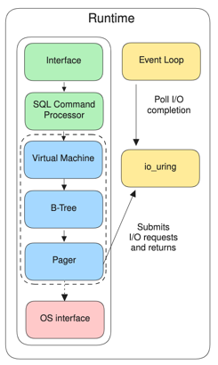

# How to contribute a SQL function implementation?

Steps
1. Pick a `SQL functions` in [COMPAT.md](../../COMPAT.md) file with a No (not implemented yet) status.
2. Create an issue for that function.
3. Implement the function in a feature branch.
4. Push it as a Merge Request, get it review.

Sample Pull Requests of function contributing
- [partial support for datetime() and julianday()](https://github.com/tursodatabase/limbo/pull/600)
- [support for changes() and total_changes()](https://github.com/tursodatabase/limbo/pull/589)
- [support for unhex(X)](https://github.com/tursodatabase/limbo/pull/353)

## An example with function `date(..)`

> Note that the files, code location, steps might be not exactly the same because of refactor but the idea of the changes needed in each layer stays.

[Issue #158](https://github.com/tursodatabase/limbo/issues/158) was created for it.
Refer to commit [4ff7058](https://github.com/tursodatabase/limbo/commit/4ff705868a054643f6113cbe009655c32bc5f235).



To add a function we generally need to touch at least the following modules
- SQL Command Processor
  - The `SQL Command Processor` module is responsible for turning sql function string into a sequence of instructions to be executed by the `Virtual Machine` module.
  - we need the following things: function definition, how the `bytecode generator` in `core/translate` generates bytecode program for this function to be executed.
- Virtual Machine `core/vdbe`
  - we need to add logic of how the `vdbe` should execute the logic of this function in Rust and write result to destination register of the vm.
  - [more info](https://www.sqlite.org/opcode.html)
- Tests

```
SQL function string 
--Tokenizer and Parser--> 
AST (enum Func)
--Bytecode Generator (core/translate)-->
Bytecode Instructions 
--Virtual Machine--> 
Result
```

TODO for implementing the function:
- analysis
  - read and try out how the function works in SQLite.
  - compare `explain` output of SQLite and Limbo.
- add/ update the function definition in `functions.rs`.
- add/ update how to function is translated from `definition` to `instruction` in virtual machine layer VDBE.
- add/ update the function Rust execution code and tests in vdbe layer.
- add/ update how the bytecode `Program` executes when steps into the function.
- add/ update TCL tests for this function in limbo/testing.
- update doc for function compatibility.

### Analysis

How `date` works in SQLite?
```bash
> sqlite3

sqlite> explain select date('now');
addr  opcode         p1    p2    p3    p4             p5  comment
----  -------------  ----  ----  ----  -------------  --  -------------
0     Init           0     6     0                    0   Start at 6
1     Once           0     3     0                    0
2     Function       0     0     2     date(-1)       0   r[2]=func()
3     Copy           2     1     0                    0   r[1]=r[2]
4     ResultRow      1     1     0                    0   output=r[1]
5     Halt           0     0     0                    0
6     Goto           0     1     0                    0
```

Comparing that with `Limbo`:
```bash
# created a sqlite database file database.db
# or cargo run to use the memory mode if it is already available.
> cargo run database.db

Enter ".help" for usage hints.
limbo> explain select date('now');
Parse error: unknown function date
```

We can see that the function is not implemented yet so the Parser did not understand it and throw an error `Parse error: unknown function date`.
- we only need to pay attention to opcode `Function` at addr 2. The rest is already set up in limbo.
- we have up to 5 registers p1 to p5 for each opcode.

### Function definition

For limbo to understand the meaning of `date`, we need to define it as a Function somewhere.
That place can be found currently in `core/functions.rs`. We need to edit 3 places
1. add to ScalarFunc as `date` is a scalar function. 
```diff
// file core/functions.rs
pub enum ScalarFunc {
  // other funcs...
  Soundex,
+ Date,
  Time,
  // other funcs...
}
```
2. add to Display to show the function as string in our program.
```diff
// file core/functions.rs
impl Display for ScalarFunc {
  fn fmt(&self, f: &mut std::fmt::Formatter<'_>) -> std::fmt::Result {
    let str = match self {
      // ...
      ScalarFunc::Soundex => "soundex".to_string(),
+     ScalarFunc::Date => "date".to_string(),
      ScalarFunc::Time => "time".to_string(),
      // ...
}
```
3. add to `fn resolve_function(..)` of `impl Func` to enable parsing from str to this function.
```diff 
// file core/functions.rs
impl Func {
  pub fn resolve_function(name: &str, arg_count: usize) -> Result<Func, ()> {
    match name {
      // ...
+     "date" => Ok(Func::Scalar(ScalarFunc::Date)),
      // ...
}
```

### Function translation

How to translate the function into bytecode `Instruction`?
- `date` function can have zero to many arguments.
- in case there are arguments, we loop through the args and allocate a register `let target_reg = program.alloc_register();`
for each argument expression.
- then we emit the bytecode instruction for Function `program.emit_insn(Insn::Function {...})`

https://github.com/tursodatabase/limbo/blob/69e3dd28f77e59927da4313e517b2b428ede480d/core/translate/expr.rs#L1235C1-L1256C26


```diff
// file core/translate/expr.rs
pub fn translate_expr(...) -> Result<usize> {
  // ...
  match expr {
    // ..
    ast::Expr::FunctionCall {
      // ...
      match &func_ctx.func {
        // ...
        Func::Scalar(srf) => {
          // ...
+          ScalarFunc::Date => {
+              if let Some(args) = args {
+                  for arg in args.iter() {
+                      // register containing result of each argument expression
+                      let target_reg = program.alloc_register();
+                      _ = translate_expr(
+                          program,
+                          referenced_tables,
+                          arg,
+                          target_reg,
+                          precomputed_exprs_to_registers,
+                      )?;
+                  }
+              }
+              program.emit_insn(Insn::Function {
+                  constant_mask: 0,
+                  start_reg: target_register + 1,
+                  dest: target_register,
+                  func: func_ctx,
+              });
+              Ok(target_register)
+          }
// ...
```

### Function execution

The function execution code is implemented in `vdbe/datetime.rs` file [here](https://github.com/tursodatabase/limbo/commit/9cc965186fecf4ba4dd81c783a841c71575123bf#diff-839435241d4ffb648ad2d162bc6ba6a94f052309865251dc2aff36eaa14fa3c5R11-R30) as we already implemented the datetime features in this file. 
Note that for other functions it might be implemented in other location in vdbe module.

```diff
// file vdbe/datetime.rs
// ...
+ pub fn exec_date(values: &[OwnedValue]) -> OwnedValue {
+   // ... implementation
+ }

// ...
```

### Program bytecode execution

Next step is to implement how the virtual machine (VDBE layer) executes the bytecode `Program` when the program step into the function instruction `Insn::Function` date `ScalarFunc::Date`.

Per [SQLite spec](https://www.sqlite.org/lang_datefunc.html#time_values) if there is no `time value` (no start register) , we want to execute the function with default param `'now'`.
>  In all functions other than timediff(), the time-value (and all modifiers) may be omitted, in which case a time value of 'now' is assumed.

```diff
// file vdbe/mod.rs
impl Program {
  pub fn step<'a>(...) {
    loop {
      // ...
      match isin {
        // ...
        Insn::Function {
          // ...
+          ScalarFunc::Date => {
+              let result =
+                  exec_date(&state.registers[*start_reg..*start_reg + arg_count]);
+              state.registers[*dest] = result;
+          }
          // ...
```

### Adding tests

There are 2 kind of tests we need to add
1. tests for Rust code
2. TCL tests for executing the sql function

One test for the Rust code is shown as example below
https://github.com/tursodatabase/limbo/blob/69e3dd28f77e59927da4313e517b2b428ede480d/core/vdbe/datetime.rs#L620C1-L661C1

TCL tests for `date` functions can be referenced from SQLite source code which is already very comprehensive. 
- https://github.com/sqlite/sqlite/blob/f2b21a5f57e1a1db1a286c42af40563077635c3d/test/date3.test#L36
- https://github.com/sqlite/sqlite/blob/f2b21a5f57e1a1db1a286c42af40563077635c3d/test/date.test#L611C1-L652C73

### Updating doc

Update the [COMPAT.md](../../COMPAT.md) file to mark this function as implemented. Change Status to 
- `Yes` if it is fully supported, 
- `Partial` if supported but not fully yet compared to SQLite.

An example:
```diff
// file COMPAT.md
| Function                     | Status  | Comment                      |
|------------------------------|---------|------------------------------|
- | date()                     | No      |                              |
+ | date()                     | Yes     | partially supports modifiers |
...
```