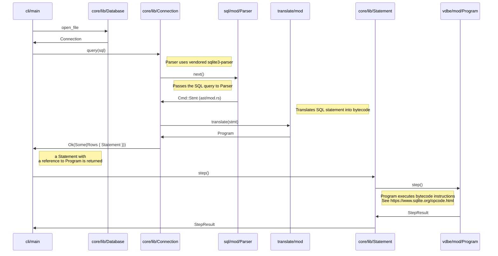

# Limbo Database System Design and Implementation

This is a work-in-progress book on the design and implementation of Limbo.

## Limbo Overview

Limbo is an in-process OLTP database system with SQLite compatibility. Unlike
client-server database systems such as PostgreSQL or MySQL, which require
applications to communicate over network protocols for SQL execution, an
in-process database is in your application memory space. This embedded
architecture eliminates network communication overhead, allowing for the best
case of low read and write latencies in the order of sub-microseconds.

Limbo's architecture resembles SQLite's but differs primarily in its
asynchronous I/O model. This asynchronous design enables applications to
leverage modern I/O interfaces like `io_uring,` maximizing storage device
performance. While an in-process database offers significant performance
advantages, integration with cloud services remains crucial for operations
like backups. Limbo's asynchronous I/O model facilitates this by supporting
networked storage capabilities.

The high-level interface to Limbo is the same as in SQLite:

* SQLite query language
* The `sqlite3_prepare()` function for translating SQL statements to programs
  ("prepared statements")
* The `sqlite3_step()` function for executing programs

If we start with the SQLite query language, you can use the `limbo`
command, for example, to evaluate SQL statements in the shell:

```
limbo> SELECT 'hello, world';
hello, world
```

To execute this SQL statement, the shell uses the `sqlite3_prepare()`
interface to parse the statement and generate a bytecode program, a step
called preparing a statement. When a statement is prepared, it can be executed
using the `sqlite3_step()` function.

To illustrate the different components of Limbo, we can look at the sequence
diagram of a query from the CLI to the bytecode virtual machine (VDBE):



To drill down into more specifics, we inspect the bytecode program for a SQL
statement using the `EXPLAIN` command in the shell. For our example SQL
statement, the bytecode looks as follows:

```
limbo> EXPLAIN SELECT 'hello, world';
addr  opcode             p1    p2    p3    p4             p5  comment
----  -----------------  ----  ----  ----  -------------  --  -------
0     Init               0     4     0                    0   Start at 4
1     String8            0     1     0     hello, world   0   r[1]='hello, world'
2     ResultRow          1     1     0                    0   output=r[1]
3     Halt               0     0     0                    0
4     Transaction        0     0     0                    0
5     Goto               0     1     0                    0
```

The instruction set of the virtual machine consists of domain specific
instructions for a database system. Every instruction consists of an
opcode that describes the operation and up to 5 operands. In the example
above, execution starts at offset zero with the `Init` instruction. The
instruction sets up the program and branches to a instruction at address
specified in operand `p2`. In our example, address 4 has the
`Transaction` instruction, which begins a transaction. After that, the
`Goto` instruction then branches to address 1 where we load a string
constant `'hello, world'` to register `r[1]`. The `ResultRow` instruction
produces a SQL query result using contents of `r[1]`. Finally, the
program terminates with the `Halt` instruction.


## Frontend

### Parser

The parser is the module in the front end that processes SQLite query language input data, transforming it into an abstract syntax tree (AST) for further processing. The parser is an in-tree fork of [lemon-rs](https://github.com/gwenn/lemon-rs), which in turn is a port of SQLite parser into Rust. The emitted AST is handed over to the code generation steps to turn the AST into virtual machine programs.

### Code generator

The code generator module takes AST as input and produces virtual machine programs representing executable SQL statements. At high-level, code generation works as follows:

1. `JOIN` clauses are transformed into equivalent `WHERE` clauses, which simplifies code generation.
2. `WHERE` clauses are mapped into bytecode loops
3. `ORDER BY` causes the bytecode program to pass result rows to a sorter before returned to the application.
4. `GROUP BY` also causes the bytecode programs to pass result rows to an aggregation function before results are returned to the application.
  
### Query optimizer

## Virtual Machine

## Pager

## I/O
