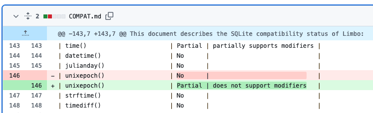

# How to contribute a SQL function implementation?

Steps
1. Pick a `SQL functions` in [COMPAT.md](../../COMPAT.md) file with a No (not implemented yet) status.
2. Create an issue for that function.
3. Implement the function in a feature branch.
4. Push it as a Merge Request, get it review.

## An example with function `unixepoch(..)`

> Note that the files, code location, steps might be not exactly the same because of refactor but the idea of the changes needed in each layer stays.

[Issue #158](https://github.com/tursodatabase/limbo/issues/158) was created for it.
Refer to commit [525f860](https://github.com/tursodatabase/limbo/commit/525f8600cacaff1dffc9e7fe9d274d89ed519149).

```
SQL_function --parser--> Func_enum ----> Instruction --VDBE--> Result
```

TODO for implementing the function:
- analysis
  - read and try out how the function works in SQLite.
  - compare `explain` output of SQLite and Limbo.
- add/ update the function definition in `functions.rs`.
- add/ update how to function is translated from `definition` to `instruction` in virtual machine layer VDBE.
- add/ update the function Rust execution code and tests in vdbe layer.
- add/ update how the bytecode `Program` executes when steps into the function.
- add/ update TCL tests for this function in limbo/testing.
- update doc for function compatibility.

### Analysis

How `unixepoch` works in SQLite?
```bash
> sqlite3

sqlite> explain select unixepoch('now');
addr  opcode         p1    p2    p3    p4             p5  comment
----  -------------  ----  ----  ----  -------------  --  -------------
0     Init           0     6     0                    0   Start at 6
1     Once           0     3     0                    0
2     Function       0     0     2     unixepoch(-1)  0   r[2]=func()
3     Copy           2     1     0                    0   r[1]=r[2]
4     ResultRow      1     1     0                    0   output=r[1]
5     Halt           0     0     0                    0
6     Goto           0     1     0                    0
```

Comparing that with `Limbo`:
```bash
# created a sqlite database file
> cargo run database.db

Limbo v0.0.2
Enter ".help" for usage hints.
limbo> explain select unixtimestamp('now');
Parse error: unknown function unixtimestamp
```

We can see that the function is not implemented yet so the Parser did not understand it and throw an error `Parse error: unknown function unixtimestamp`.
- we only need to pay attention to opcode `Function` at addr 2. The rest is already set up in limbo.
- we have up to 5 registers p1 to p5 for each opcode.

### Function definition

For limbo to understand the meaning of `unixtimestamp`, we need to define it as a Function somewhere.
That place can be found currently in `core/functions.rs`. We need to edit 3 places
1. add to ScalarFunc as `unixtimestamp` is a scalar function.
2. add to Display to show the function as string in our program.
3. add to `fn resolve_function(..)` of `impl Func` to enable parsing from str to this function.

https://github.com/tursodatabase/limbo/blob/69e3dd28f77e59927da4313e517b2b428ede480d/core/function.rs#L86

https://github.com/tursodatabase/limbo/blob/69e3dd28f77e59927da4313e517b2b428ede480d/core/function.rs#L131

https://github.com/tursodatabase/limbo/blob/69e3dd28f77e59927da4313e517b2b428ede480d/core/function.rs#L331

### Function translation

How to translate the function into bytecode `Instruction`?

https://github.com/tursodatabase/limbo/blob/525f8600cacaff1dffc9e7fe9d274d89ed519149/core/translate/expr.rs#L971C1-L989C48

### Function execution

https://github.com/tursodatabase/limbo/commit/525f8600cacaff1dffc9e7fe9d274d89ed519149#diff-839435241d4ffb648ad2d162bc6ba6a94f052309865251dc2aff36eaa14fa3c5L94-R111

### Program bytecode execution

https://github.com/tursodatabase/limbo/commit/525f8600cacaff1dffc9e7fe9d274d89ed519149#diff-14ede55920ec82e719d3d39a4c38a6b5c0d3e4fa1e7ff4d75e7f436820920fa7L33-R1392

If there is no `time value` (no start register) , we want to execute the function with default param `'now'` as in [SQLite spec](https://www.sqlite.org/lang_datefunc.html#time_values).

>  In all functions other than timediff(), the time-value (and all modifiers) may be omitted, in which case a time value of 'now' is assumed.

```rust 
if *start_reg == 0 {
    let unixepoch: String =
        exec_unixepoch(&OwnedValue::Text(Rc::new("now".to_string())))?;
    state.registers[*dest] = OwnedValue::Text(Rc::new(unixepoch));
}
```

### Adding tests

Tests for `unixepoch` functions can be referenced from SQLite source code which is already very comprehensive. 
- https://github.com/sqlite/sqlite/blob/f2b21a5f57e1a1db1a286c42af40563077635c3d/test/date3.test#L36
- https://github.com/sqlite/sqlite/blob/f2b21a5f57e1a1db1a286c42af40563077635c3d/test/date.test#L604

https://github.com/tursodatabase/limbo/commit/525f8600cacaff1dffc9e7fe9d274d89ed519149#diff-a262766efd02e804b8dc2ac5642f2061fb59a9388e437e9f000ff289110c9ec0L123-R145

### Updating doc

Update the COMPAT.md file to mark this function as implemented. Change Status to 
- `Yes` if it is fully supported, 
- `Partial` if supported but not fully yet compared to SQLite.


