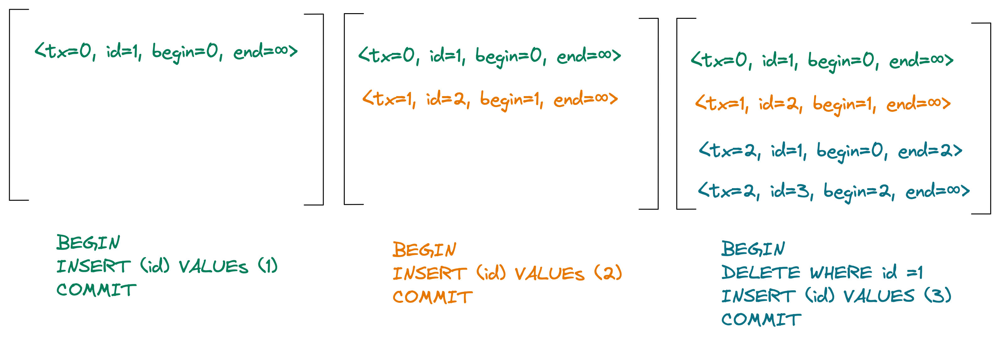

# Design

## Persistent storage

Persistent storage must implement the `Storage` trait that the MVCC module uses for transaction logging.

Figure 1 shows an example of write-ahead log across three transactions.
The first transaction T0 executes a `INSERT (id) VALUES (1)` statement, which results in a log record with `id` set to `1`, begin timestamp to 0 (which is the transaction ID) and end timestamp as infinity (meaning the row version is still visible).
The second transaction T1 executes another `INSERT` statement, which adds another log record to the transaction log with `id` set to `2`, begin timesstamp to 1 and end timestamp as infinity, similar to what T0 did.
Finally, a third transaction T2 executes two statements: `DELETE WHERE id = 1` and `INSERT (id) VALUES (3)`. The first one results in a log record with `id` set to `1` and begin timestamp set to 0 (which is the transaction that created the entry). However, the end timestamp is now set to 2 (the current transaction), which means the entry is now deleted.
The second statement results in an entry in the transaction log similar to the `INSERT` statements in T0 and T1.

Figure 1. Transaction log of three transactions.

When MVCC bootstraps or recovers, it simply redos the transaction log.
If the transaction log grows big, we can checkpoint it it by dropping all entries that are no longer visible after the the latest transaction and create a snapshot.
