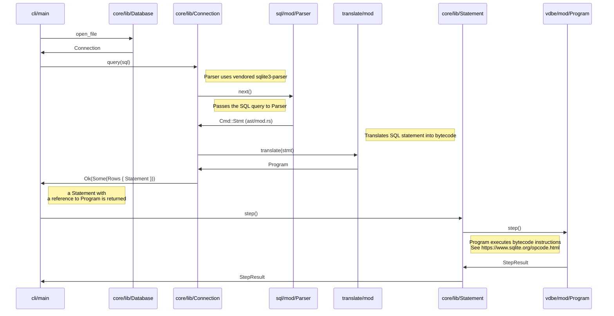

The following sequence diagram shows the typical flow of a query from the CLI to the [VDBE](https://www.sqlite.org/opcode.html).

```mermaid
sequenceDiagram

participant main as cli/main
participant Database as core/lib/Database
participant Connection as core/lib/Connection
participant Parser as sql/mod/Parser
participant translate as translate/mod
participant Statement as core/lib/Statement
participant Program as vdbe/mod/Program

main->>Database: open_file
Database->>main: Connection
main->>Connection: query(sql)
Note left of Parser: Parser uses vendored sqlite3-parser
Connection->>Parser: next()
Note left of Parser: Passes the SQL query to Parser

Parser->>Connection: Cmd::Stmt (ast/mod.rs)

Note right of translate: Translates SQL statement into bytecode
Connection->>translate:translate(stmt)

translate->>Connection: Program 

Connection->>main: Ok(Some(Rows { Statement }))

note right of main: a Statement with <br />a reference to Program is returned

main->>Statement: step()
Statement->>Program: step()
Note left of Program: Program executes bytecode instructions<br />See https://www.sqlite.org/opcode.html
Program->>Statement: StepResult
Statement->>main: StepResult
```
